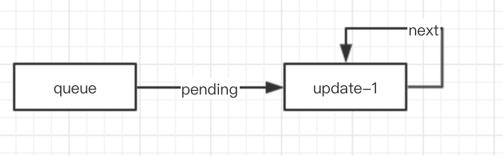
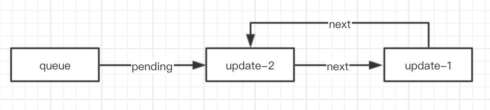
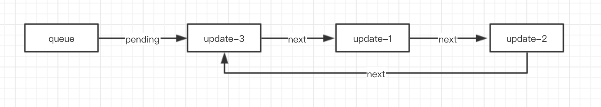

## React Hooks 源码分析

### useState的浅分析 


### Hook定义

1. **memoizedState:**指向当前渲染节点 Fiber, 上一次完整更新之后的最终状态值

2. **baseState：**初始化 initialState， 以及每次 dispatch 之后 newState

3. **baseQueue：**当前需要更新的 Update ，每次更新完之后，会赋值上一个 update，方便 react 在渲染错误的边缘，数据回溯
4. **next：**  链接到下一个 hooks
5. **queue：** 缓存的更新队列，存储多次更新行为
   1. **pending**: 保存最后一次更新逻辑, 即状态值和下一次 Update
   2. **dispatch**: 更新行为

### queue 队列更新逻辑

1. 第一次更新

   ```javascript
   假设 update = [update-1]
   
   update.next = update
   [update-1]---next-->[update-1]
   
   Queue.pending = update
   ```

   

2. 第二次更新

   ```javascript
   假设：update = update-2
   
   update.next = pending.next;
   
   pending.next = [update-1]
   [update-2]--next-->[update-1]
   
   pending.next = update;
   [update-1]---next--->[update-2]
   
   queue.pending = update;
   如下图所示
   ```

   

3.依次类推...



queue的规则：

- queue.pending指向最新的一次更新
- pending.next指向第一次更新
- 后面就依次类推


### 参考文档

1. https://juejin.im/post/5dc6e1b35188251ab9183c7d
2. https://react.jokcy.me/book/hooks/hooks-start.html